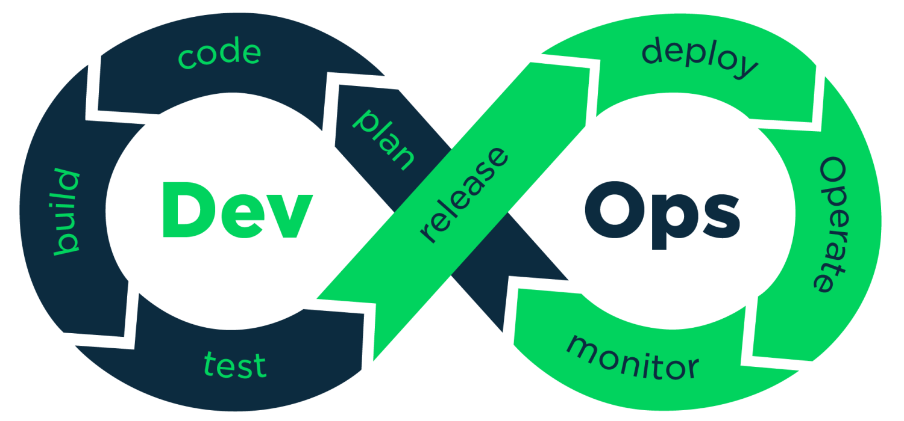

<h1 align="center">Hi I'm Pouriya M. Tabari , a DevOps Engineer</h1>

A 29 years old self-taught DevOps in Iran

  

## ⚡ My Platforms

  

## ⚡ :hammer_and_wrench: Languages and Tools :

### :fire: My Stats :

  

## 🌎 Find me
- virgol: [virgol posts](https://virgool.io/@ptabari) :mag:
- blog: click [Pouriya-tabari blogs](https://pouriya-tabari.ir/):earth_asia:
- email:  <a href="mailto:pouriya_tabari@outlook.com">outlook mail</a>:e-mail:

<!--
**pouriatabari/pouriatabari** is a ✨ _special_ ✨ repository because its `README.md` (this file) appears on your GitHub profile.

Here are some ideas to get you started:

- 🔭 I’m currently working on ...
- 🌱 I’m currently learning ...
- 👯 I’m looking to collaborate on ...
- 🤔 I’m looking for help with ...
- 💬 Ask me about ...
- 📫 How to reach me: ...
- 😄 Pronouns: ...
- ⚡ Fun fact: ...
-->
